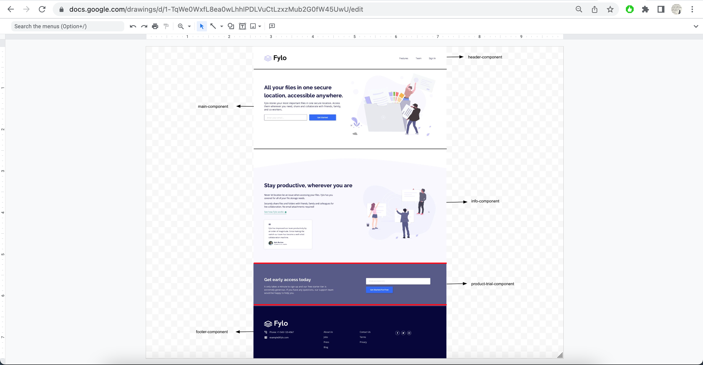
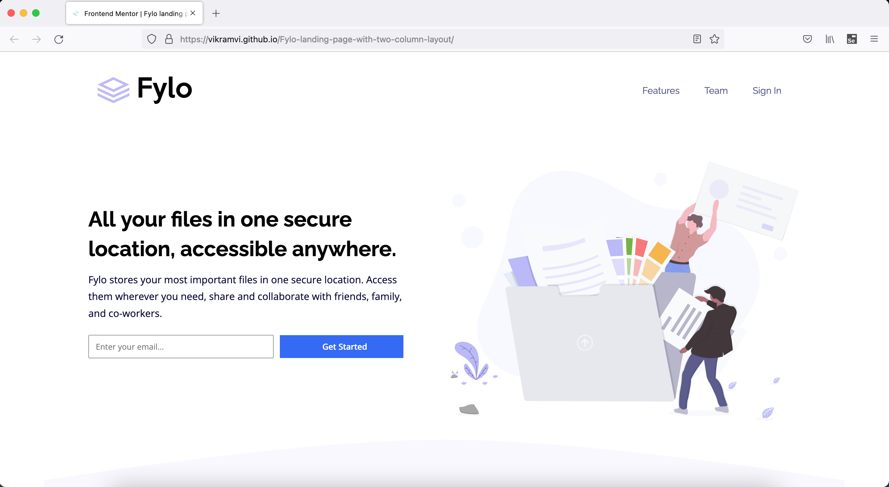
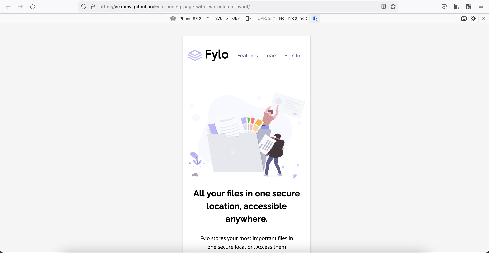

# Frontend Mentor - Fylo landing page with two column layout solution

This is a solution to the [Fylo landing page with two column layout challenge on Frontend Mentor](https://www.frontendmentor.io/challenges/fylo-landing-page-with-two-column-layout-5ca5ef041e82137ec91a50f5). Frontend Mentor challenges help you improve your coding skills by building realistic projects.

## Table of contents

- [Overview](#overview)
  - [The challenge](#the-challenge)
  - [Screenshot](#screenshot)
  - [Links](#links)
- [My process](#my-process)
  - [Built with](#built-with)
  - [What I learned](#what-i-learned)
  - [Continued development](#continued-development)
  - [Useful resources](#useful-resources)
- [Author](#author)
- [Acknowledgments](#acknowledgments)

## Overview

This is 14th project from "Frontend Mentor" to sharpen HTML & CSS skills along with responsive web design and it's build with "BEM", "Grid & Flexbox layout", "min-width, max-width, width in various units & with help of Google ofcourse".

### The challenge

Users should be able to:

- View the optimal layout for the site depending on their device's screen size
- See hover states for all interactive elements on the page

### Screenshot

### Links

- [Live Website](https://vikramvi.github.io/Fylo-landing-page-with-two-column-layout/)

## My process

### Built with

- Semantic HTML5 markup
- BEM
- Mobile-first workflow
- CSS Grid
- Flexbox
- min-width, max-width & width in various units
- Chrome and FF Dev Tools
- Googling
